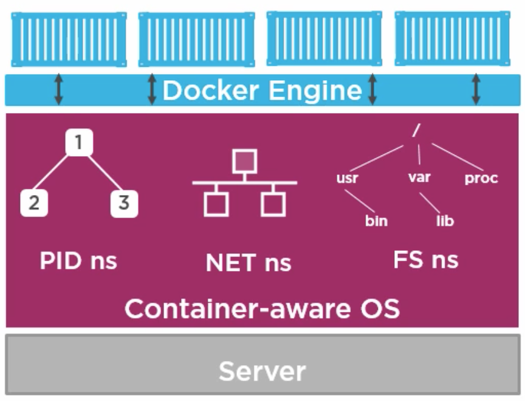
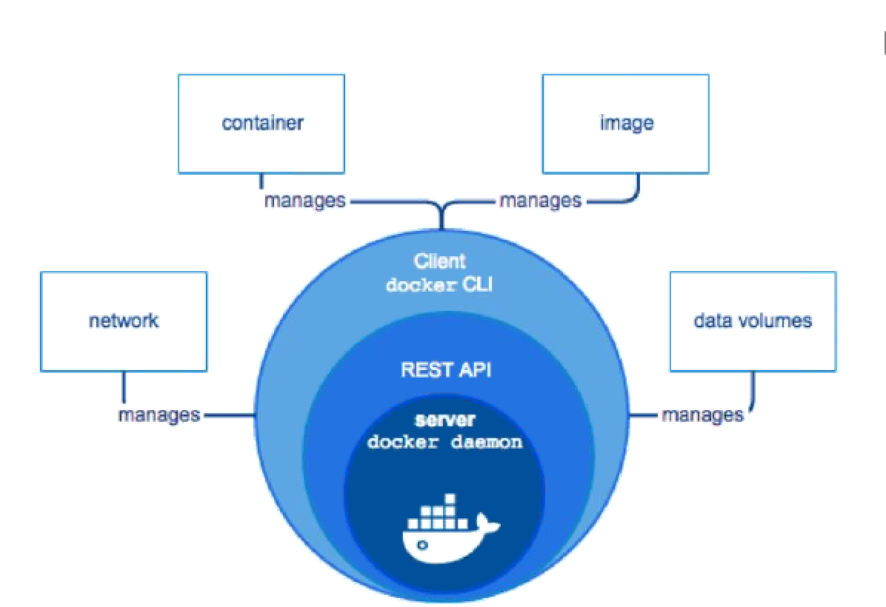

Docker Intro:
A server is usually shared by multiple containers without even installing a VM for supporting Docker! Docker containers are just processees in Linux. Mac, and Windows run containers on a single VM. This VM could be a docker machine or something else in Windows.

Docker History:
Docker engine has become open source. It is licensed under Apache 2.0
Sub projects: clustering, orchestration, security, registry are all subprojects that forms an ecosystem for docker.

DockerHub Registry: 

- Public Repository statistics:
  Over 1 billion image pulls
  over 240k repositories
  over 5 million image pulls per day

Open Container Initiative:
Container format and container runtime

Core OS is another company that didn't like what docker was providing and they create a new container runtime solution ROCK IT! Core OS found that Docker wasn't secure. They were right!
They released apc specification. 

There were two competing standards in the market. So, Docker and RKT came together and formed a singular specification OCI(Open Container Initiative)
The initiative standardized
- Contianer format and
- Container runtime

## Docker containers are Stateful
When container is stopped, it doesn't wipe it's data that was persisted in the container during the boot or during the operation
Restarting the container brings back the data. Eg: file systems, other network settings and other configuration data
When docker container is destroyed, the data is lost. However data in VOLUMES are not lost. These could be remote VOLUME mappings

Docker containers work better for both stateful and stateless nature of the Apps. You need to understand where the storage is occupied though. 

## Docker model
Docker engine doesn't really require a VM if it's running on Linux. This engine would essentially shared resources that 
are povided at the OS level

 

## Docker components
- Image - a readonly component of what you want to run
- container - a runnable component of an image
- Network - private or public networks for containers to attach to
- Volumes - a place for containers to store data that lives outside the container

## Presentation

[docker-presentation](./01-docker.pptx) 